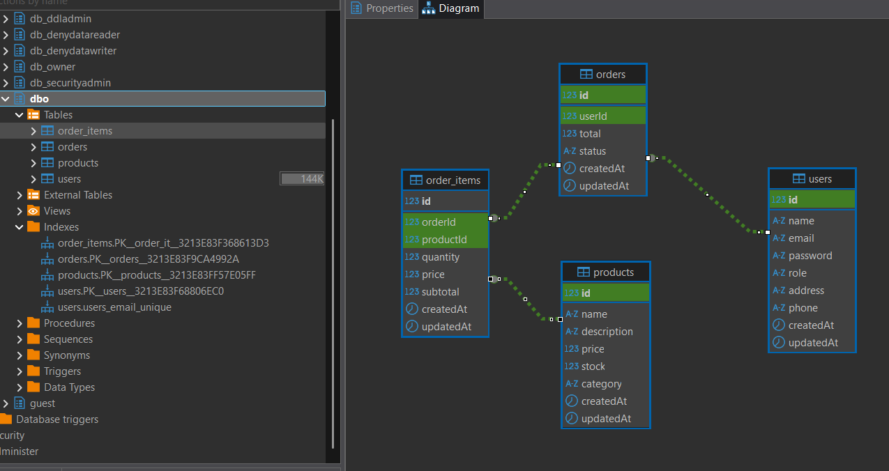
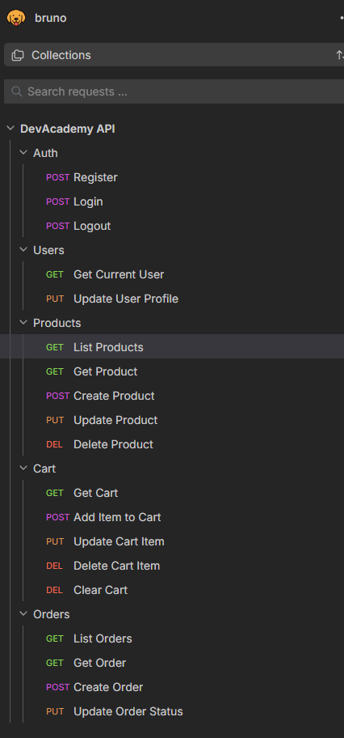
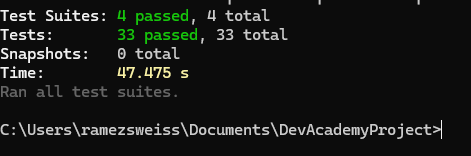
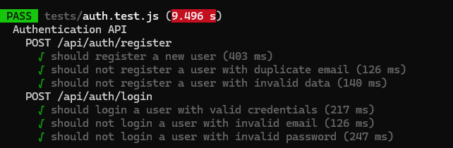
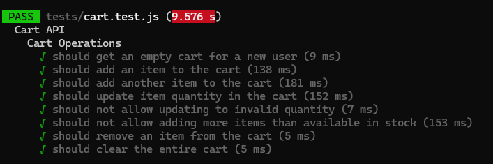
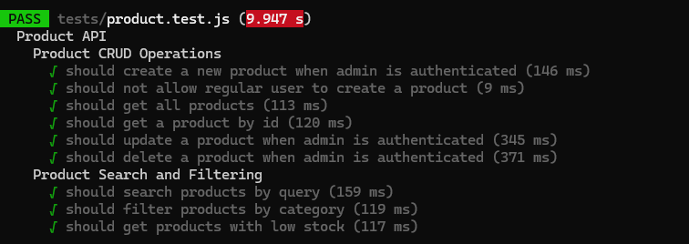
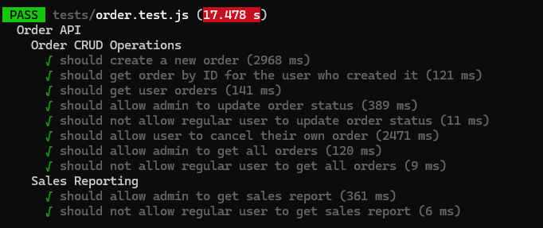

# DevAcademy Project - Backend Implementation

## Project Overview

This project implements an e-commerce platform backend using modern web development practices and design patterns that were learned through the FY25 Dev Academy. The application is built with a multi-layered architecture that follows clean code principles and best practices for scalability, maintainability, and security.

This project was build using JavaScript, mainly utilizing Node.js and Express.js framework.

**Author**: Ramez Sweiss.

**Date of submission**: June 23rd, 2025.

## Table of Contents

1. Architecture Overview
2. Brief about Key Features
3. Technology Stack
4. Implementation Details
   - User Management
   - Product Catalog Management
   - Shopping Cart & Order Placement
   - Database Implementation
5. Some talks about Design Patterns
6. Testing
7. API Documentation
8. Performance Optimization
9. Getting Started

## Architecture Overview

The application implements a multi-layered architecture with clear separation of concerns, also utilizing principales of OOP:

1. Controller Layer: Handles HTTP requests and responses, input validation, and route management
2. Service Layer: Contains business logic and orchestrates operations between repositories
3. Repository Layer: Implements data access logic and abstractions over the database
4. Model Layer: Defines data structures and relationships between entities
5. Middleware Layer: Provides cross-cutting concerns like authentication, error handling, etc.


```
├── controllers     # Request handlers for API endpoints
├── services        # Business logic implementation
├── repositories    # Data access layer with repository pattern
├── models          # Data models and schema definitions
├── middleware      # Cross-cutting concerns like auth and error handling
├── routes          # API route definitions
├── database        # Database configuration and connection
├── utils           # Utility functions and helpers
```

## Technology Stack

- Node.js: Runtime environment
- Express.js: Web framework for building RESTful APIs
- Sequelize ORM: Object-relational mapping for database operations
- JWT: JSON Web Token for authentication
- Jest: Testing framework
- Bruno: API testing and documentation tool

## Key Features

### 1. User Management (Authentication & Authorization)

The system implements a comprehensive user management system with:

- Secure user registration and login
- Role-based access control (User and Admin roles)
- Password hashing for secure storage
- JWT-based authentication
- Protected routes based on roles

Implementation Details:
- User authentication is handled through JWT tokens
- User passwords are securely hashed before storage
- Authentication middleware validates tokens on protected routes
- Authorization middleware checks user roles for admin-only routes

Refer to ```AuthController.js```, ```authMiddleware.js```, and the respective models.```

### 2. Product Catalog Management

The product management system provides:

- CRUD operations for products (admin only for create, update, delete)
- Product categorization
- Search functionality
- Inventory management

Implementation Details:
- Products can be created, updated, and deleted by admins
- Products are categorized for easy browsing
- Search functionality implemented in the ProductRepository, using utils for fuzzy string matches (levenstein distance, and BST)
- Stock levels are tracked and updated during order processing
- Low stock reports for inventory management

Refer to ```ProductRepository.js```, ```Product.js``` model, and ```productController.js```, and ```searchUtils.js```.

### 3. Shopping Cart & Order Placement

The shopping cart system allows:

- Adding items to cart
- Updating quantities
- Removing items
- Cart persistence
- Order creation from cart contents

Implementation Details:
- Cart is associated with a user
- Items can be added, updated, and removed from the cart
- Order creation process includes:
  - Validating product availability
  - Transaction management for data consistency
  - Stock updates
  - Order history tracking

Refer to ```Order``` and ```OrderItem``` repositories, models, and controllers.

### 4. Database Implementation & Relationships

The database schema includes:

- Users
- Products
- Orders
- OrderItems
- Carts

Entity Relationships:
- User has many Orders
- Order belongs to User
- Order has many OrderItems
- OrderItem belongs to Order
- OrderItem belongs to Product
- Product has many OrderItems

The implementation uses ```Sequelize``` ORM for database interactions and ensures data integrity through:
- Foreign key constraints
- Data validation at model level
- Transaction support for critical operations

**Below is high level Diagram showing the Database Schema structure and Indexes.**



## Design Patterns

The project implements several design patterns:

### Repository Pattern

A BaseRepository class provides common CRUD operations, which is extended by specific repositories for each entity:

```javascript
//these are high level  to demo, check the actual source code for full implementations
class BaseRepository {
  constructor(model) {
    this.model = model;
  }
  
  async findAll(options = {}) {
    return await this.model.findAll(options);
  }
  
  async findById(id, options = {}) {
    return await this.model.findByPk(id, options);
  }
  //etc
  
}
```

Entity-specific repositories extend this base class:

```javascript
class ProductRepository extends BaseRepository {
  constructor() {
    super(Product);
  }
  
  // functions for product-specific operations
  async search(query, options = {}) {
    //...
  }
  
  async findByCategory(category, options = {}) {
    //...
  }
}
```

### Service Layer Pattern

Services encapsulate business logic and orchestrate operations between repositories:

```javascript
class OrderService {
  async createOrder(orderData) {
    // Start transaction
    const transaction = await sequelize.transaction();
    
    try {
      // Order creation logic & databricks transaction mgmt
      
      await transaction.commit();
      return order;
    } catch (error) {
      await transaction.rollback();
      throw error;
    }
  }
}
```

### Middleware Pattern

The application uses middleware for cross-cutting concerns:

```javascript
// authentication middleware
const authenticate = (req, res, next) => {
  // token validation (jwt) and user loading
};

// error handling middleware
const errorHandler = (err, req, res, next) => {
  // central error handler with standarized responses.
};
```

## RESTful API Development

The API is designed following RESTful principles with standardized endpoints, below are the endpoints, and I have added a json (```./DevAcademyAPIs/DevAcademy APIs/bruno.json```) containing the full API doc, you can easily import it into Bruno to see the complete set of APIs in action.

Below is the summary of the endpoints used within this project.

### Authentication Endpoints
- POST /api/auth/register - Create a new user account
- POST /api/auth/login - Generate authentication token

### User Endpoints
- GET /api/users - Get all users (admin only)
- GET /api/users/:id - Get user by ID
- PUT /api/users/:id - Update user
- DELETE /api/users/:id - Delete user (admin only)

### Product Endpoints
- GET /api/products - Get all products
- GET /api/products/:id - Get product by ID
- GET /api/products/search - Search products
- GET /api/products/category/:category - Get products by category
- GET /api/products/low-stock - Get products with low stock (admin only)
- POST /api/products - Create product (admin only)
- PUT /api/products/:id - Update product (admin only)
- DELETE /api/products/:id - Delete product (admin only)

### Cart Endpoints
- GET /api/cart - Get user's cart
- POST /api/cart/items - Add item to cart
- PUT /api/cart/items/:productId - Update item quantity
- DELETE /api/cart/items/:productId - Remove item from cart
- DELETE /api/cart - Clear cart

### Order Endpoints
- GET /api/orders - Get all orders (admin only)
- GET /api/orders/my-orders - Get user's orders
- GET /api/orders/:id - Get order by ID
- POST /api/orders - Create order
- PUT /api/orders/:id/status - Update order status (admin only)
- POST /api/orders/:id/cancel - Cancel order

### Reporting Endpoints
- GET /api/orders/reports/sales - Get sales report (admin only)

## API Testing

The project includes comprehensive API tests using Bruno, additionally, there is a complete set of unit tests that can simply be run to validate all the functionality/feature requirements.

- Collection of API requests organized by resource type
- Environment variables for base URL and tokens
- Test requests for all API endpoints
- Authentication flow tests
- CRUD operation tests for each resource
- Error case tests

Please refer to the Unit Testing section below for details on the unit tests.




## Reporting & Analytics

The application implements reporting capabilities through:

- Sales reporting by date range
- Product performance analysis
- Top-selling products identification
- Low stock alerts

Implementation example from OrderItemRepository:

```javascript
async getTopSellingProducts(startDate, endDate, limit = 5) {
  return await OrderItem.findAll({
    attributes: [
      'productId',
      [fn('SUM', col('quantity')), 'totalSold'],
      [fn('SUM', col('subtotal')), 'totalRevenue']
    ],
    include: [...],
    group: [...],
    order: [literal('SUM(quantity) DESC')],
    limit
  });
}
```

## Performance Optimization & Unit Testing

### Performance Optimizations

- Efficient database queries with proper indexing
- Transaction management for data consistency
- Query optimization in repository methods
- In addition, utils contains optimized search functionality, including Binary search tree (BST), and fuzzy sting search using Levenstein Distance.

### Unit Testing

The project includes comprehensive unit tests using Jest and Supertest:

- Authentication tests
- Product CRUD operation tests
- Cart functionality tests
- Order placement and management tests
- Authorization and permission tests

To run all the tests, we can run below command from root directory of the project.

```npx jest --config=jest.config.js --runInBand```

**Below is some screenshots showing the outcomes of all the 33 test cases, across 4 tests suites.








## Getting Started

1. Clone the repository
2. Install dependencies: `npm install`
5. Start the development server: `npm run dev` or simply ```node server.js```
6. Run tests: `npx jest --config=jest.config.js --runInBand`

**Note:** The Database of choise is Azure SQL Database hosted in my subscription. Since it is dev, I am setting it to Auto "Pause". So in case above doesn't work, it is likely that the DB is in paused state, and will need to be manually "Started".


## Additional details

I have used Javascript and its framework instead of C# and .NET core due to time constraints and my existing familiarity with Javascript. However, regardless of the programming language used, I have used alternatives frameworks that get the job done in the same way as the .NET framework (Example, using Sequelize ORM instead of EF Core, etc...)

Next step for me is to re-factor this project to C# and .NET so I can learn the language by doing. Additionally, I will practice nextjs by creating a beautiful UI for this backend.

In case you try to run this project and it doesn't start due to database being in "Pause", please reach out and I will start it for you. Alternatively, if you have a localdb, please do update the env variables or the db.js file with your own db, I have included a script that will create the tables directly on server start.

If any further info/clarification on implementation of any of the features is required, please let me know.